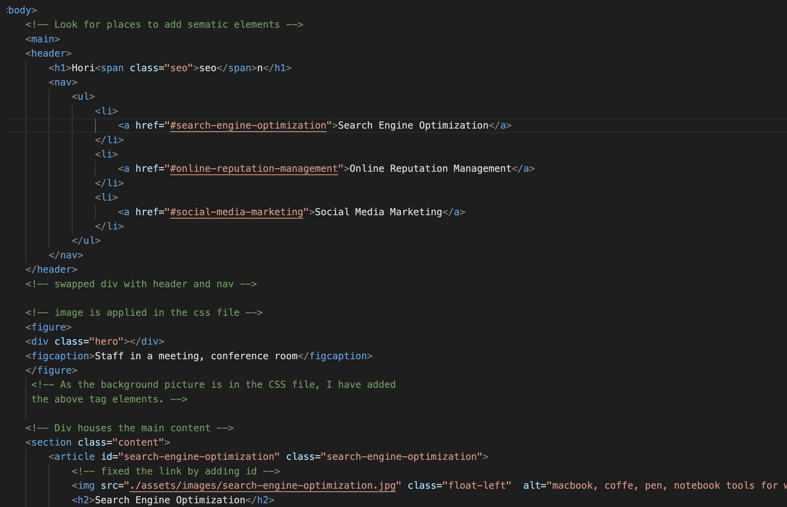

# Horiseon-project

One of the first projects in which I didn't build any code but instead went and restructured and used semantic elements for accessibility and optimisation.
It was a great challenge to build my skills for structuring and reformatting a page. Also, I’ve learned about the importance of accessibility.

## Notes and Guide.

Provide a short description explaining the what, why, and how of your project. Use the following questions as a guide:

-This is my first project of this kind, on-the-job-ticket, adding and removing features on demand. I was excited to go through the code and have to reformat it in order to meet the accessibility criteria.This is one of the first projects, I successfuly removed all the non-sematic tags in the HMTL file and added semantic tags, also I updated the Css fille in order to comply with the restructed code.

- In this project we introduce the on-the-job ticket assignment, using GitHub to deploy our work and of course, getting familiar with semantic HTML and the use of these tags.
  -The project helps screen readers to better go through the content and also helps SEO engines to find information better.
  -There is a lot to learn ahead, but this is a good introduction to the importance of having a well-structured code .

## Installation

N/A

## Usage

In order to make the best use of this web page, please check if section as it contains notes about that specific topic.Also we can see throughout the code that there are comments with notes about the changes.

## Credits

N/A

## License

MIT Licence
